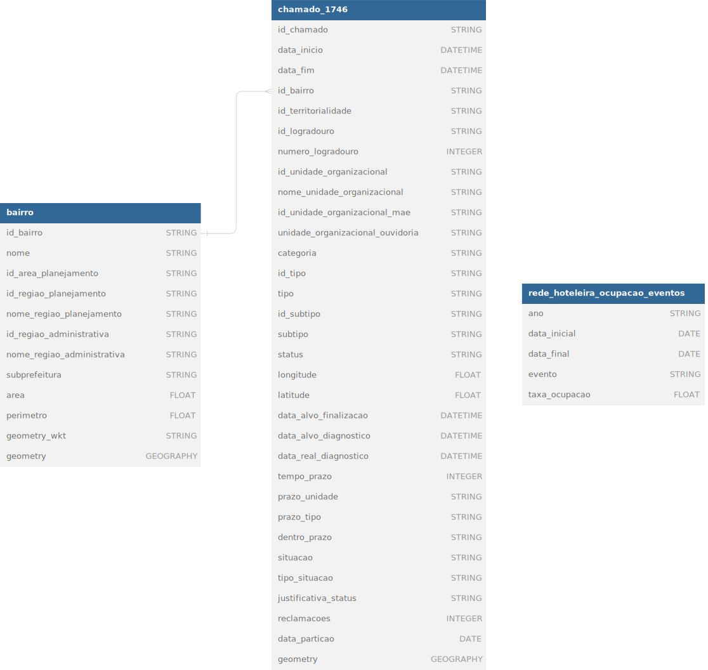

<h1 align="center">
    <a href="https://www.1746.rio/hc/pt-br" target="_blank"></a>
    </br>Análise de chamados da Central 1746
</br>


</h1>

<div align="center">


<p>Dashboard interativo para visualização e análise dos dados da Central 1746 do Rio de Janeiro.</p>

<hr/>
<table border=0 cellspacing=0 celspadding=0>
  <tr>
    <td></td>
    <td></td>
    <td></td>

  </tr>
</table>
</div>

## :pushpin: Tópicos

- [📃 Sobre o Projeto](#page_with_curl-sobre-o-projeto)
- [🎉 Funcionalidades](#tada-funcionalidades)
- [🔧 Pré-requisitos](#wrench-pré-requisitos)
- [🚀 Como Rodar o Projeto](#rocket-como-rodar-o-projeto)
    - [🐳 Docker ou Docker Compose](#whale-docker-ou-docker-compose)
    - [📦 Poetry](#package-poetry)
    - [🐍 Pip](#snake-pip)
- [💾 Dados](#floppy_disk-dados)
- [👀 Solução do Desafio](#eyes-solução-do-desafio)

## :page_with_curl: Sobre o Projeto

Este projeto consiste em um dashboard interativo para visualização e análise dos dados da Central 1746 do Rio de Janeiro durante o período de 2022 a 2023. A Central 1746 é responsável por receber e registrar solicitações, reclamações e denúncias dos cidadãos relacionadas a serviços públicos municipais.


## :tada: Funcionalidades

- Visualização de informações gerais sobre os atendimentos realizados.
- Análise ao longo do tempo.
- Geolocalização com destaque para os bairros com maior número de ocorrências.

## :wrench: Pré-requisitos

Antes de executar a aplicação, certifique-se de ter os seguintes pré-requisitos instalados e configurados em sua máquina:

- Ambiente com Python 3.10
- [DVC](https://dvc.org/doc/install) com suporte ao Google Drive
- [Docker](https://docs.docker.com/manuals/) (caso opte por executar a aplicação via Docker)
- [Poetry](https://python-poetry.org/docs/#installation) (caso opte por utilizar Poetry)

Além disso, é necessário baixar os dados necessários para a aplicação via DVC do Google Drive. Para baixar os dados, execute os seguintes comandos:


```bash
# Instale o DVC com suporte ao Google Drive (caso ainda não tenha instalado)
python -m pip install "dvc[gdrive]"

# Clone o repositório
git clone https://github.com/jessicacardoso/emd-analise-central-1746.git

# Acesse o diretório do projeto
cd emd-analise-central-1746

# Baixe os dados necessários no diretório data
dvc get https://github.com/jessicacardoso/emd-analise-central-1746/ \
    data/rede_hoteleira_ocupacao_eventos.parquet \
    -o data/rede_hoteleira_ocupacao_eventos.parquet

dvc get https://github.com/jessicacardoso/emd-analise-central-1746/ \
    data/bairro.parquet -o data/bairro.parquet

dvc get https://github.com/jessicacardoso/emd-analise-central-1746/ \
    data/chamado_1746.parquet -o data/chamado_1746.parquet
```

## :rocket: Como Rodar o Projeto

Após instalar e configurar os pré-requisitos, você pode executar a aplicação via Docker, Poetry ou Pip. Escolha a opção que preferir:

### :whale: Docker ou Docker Compose

Se você preferir utilizar Docker, siga os passos abaixo:

1. Certifique-se de ter o Docker instalado em sua máquina.

2. Execute o seguinte comando para construir a imagem Docker:
    ```bash
    docker build -t dashboard-1746 .
    ```
3. Após a construção da imagem, execute o seguinte comando para iniciar o contêiner:
    ```bash
    docker run -p 8501:8501 dashboard-1746
    ```
4. Ou, se preferir, execute o seguinte comando para iniciar o contêiner com o Docker Compose:
    ```bash
    docker compose up
    ```
5. Acesse a aplicação em seu navegador através do seguinte endereço:
http://localhost:8501.

### :package: Poetry

Se você prefere usar Poetry, siga os passos abaixo:

1. Instale as dependências do projeto.
    ```bash
    poetry install
    ```
2. Após a instalação das dependências, execute o seguinte comando para iniciar a aplicação:
    ```bash
    poetry run streamlit run streamlit_app.py
    ```
3. Acesse o endereço exibido no terminal (normalmente http://localhost:8501).

### :snake: Pip

Se você prefere usar o pip, siga os passos abaixo:

1. Instale as dependências do projeto.
    ```bash
    pip install -r requirements.txt
    ```

2. Após a instalação das dependências, execute o seguinte comando para iniciar a aplicação:
    ```bash
    streamlit run streamlit_app.py
    ```
3. Acesse o endereço exibido no terminal (normalmente http://localhost:8501).

## :floppy_disk: Dados

Os dados utilizados neste projeto foram obtidos do projeto `datario`, disponível no Google Cloud Platform. Eles contêm informações sobre as ocorrências registradas na Central 1746, incluindo detalhes como tipo de serviço, localização, data e hora. As instruções para obter os dados estão disponíveis no [tutorial do Escritório de Dados](https://docs.dados.rio/tutoriais/como-acessar-dados/).

Abaixo, temos um diagrama das tabelas utilizadas no projeto:

<div align="center">
    
</div>

## 	:eyes: Solução do Desafio

A solução das questões propostas no desafio está disponível no diretório `desafio`. Para acessar a solução, [clique aqui](desafio/README.md). Também foram desenvolvidos notebooks contendo a análise exploratória dos dados e previsão de chamados por status e no prazo. Para acessar os notebooks, [clique aqui](notebooks/README.md).
