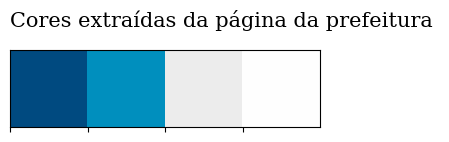
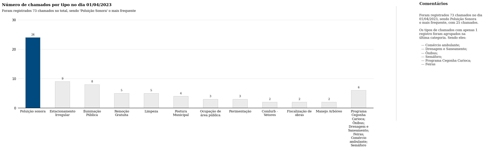
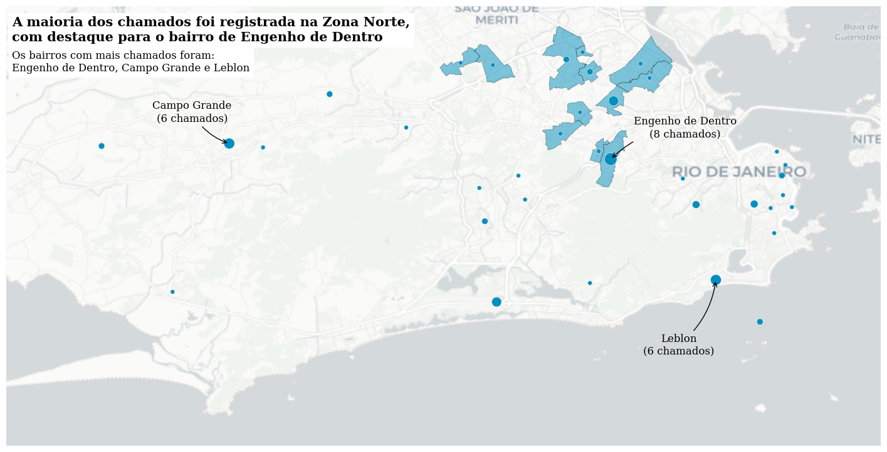
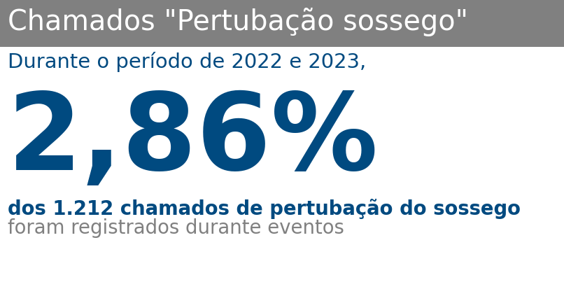
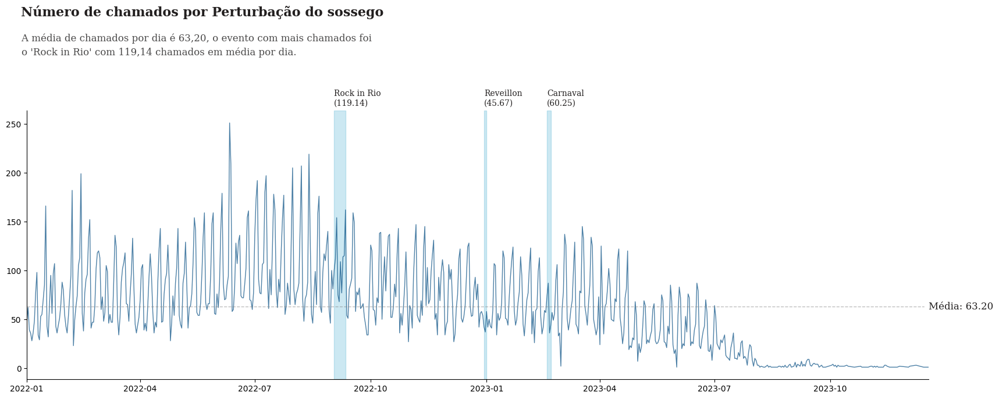

# Análise de chamados ao 1746

Scripts em python usando pandas para responder as perguntas a seguir.

Requisitos:
- Python 3.10
- Pandas 1.5.3 (versão do pandas compatível com a versão do pandas do basedosdados)
- basedosdados

No terminal, na pasta `desafio`, execute:
```bash
pip install -r requirements.txt
```

## Importando bibliotecas


```python
billing_project_id = "emd-analise-dados-1746"  # Troque pelo seu billing project id
```


```python
import numpy as np
import pandas as pd
import basedosdados as bd
import geopandas as gpd


from datetime import date

from pywaffle import Waffle
import seaborn as sns
import matplotlib.pyplot as plt
import matplotlib.lines as lines

from textwrap import wrap

import contextily as ctx
```


```python
# Palette
sns.palplot(["#004A80", "#008FBE", "#ECECEC", "#FEFEFE"])

plt.title(
    "Cores extraídas da página da prefeitura ",
    loc="left",
    fontfamily="serif",
    fontsize=15,
    y=1.2,
)
plt.show()
```





## 1. Localização de chamados do 1746


```python
calls = bd.read_sql(
    """
    SELECT
        *
    FROM
        `datario.administracao_servicos_publicos.chamado_1746`
    WHERE
        data_particao = "2023-04-01";
    """,
    billing_project_id=billing_project_id,
)
```

    Downloading: 100%|██████████| 65938/65938 [00:21<00:00, 3117.46rows/s]


```python
neighborhoods = bd.read_sql(
    """
    SELECT
        *
    FROM
        `datario.dados_mestres.bairro`;
    """,
    billing_project_id=billing_project_id,
)
```

    Downloading: 100%|██████████| 164/164 [00:11<00:00, 13.92rows/s]


1. Quantos chamados foram abertos no dia 01/04/2023?


```python
# 1. Quantos chamados foram abertos no dia 01/04/2023?
calls_01042023 = calls[calls["data_inicio"].dt.date == date(2023, 4, 1)]
print(f"Foram abertos {calls_01042023.shape[0]} chamados no dia 01/04/2023")
```

    Foram abertos 73 chamados no dia 01/04/2023


2. Qual o tipo de chamado que teve mais reclamações no dia 01/04/2023?


```python
# 2. Qual o tipo de chamado que teve mais reclamações no dia 01/04/2023?
most_complained_type = calls_01042023["tipo"].value_counts().idxmax()
print(
    f'O tipo de chamado que teve mais reclamações no dia 01/04/2023 foi "{most_complained_type}"'
)
```

    O tipo de chamado que teve mais reclamações no dia 01/04/2023 foi "Poluição sonora"


```python
number_of_calls_by_type = calls_01042023["tipo"].value_counts()
number_of_calls_by_type[
    "; ".join(number_of_calls_by_type.loc[lambda x: x < 2].index)
] = number_of_calls_by_type.loc[number_of_calls_by_type < 2].sum()

number_of_calls_by_type = number_of_calls_by_type.loc[lambda x: x >= 2]

color_map = ["#ECECEC" for _ in range(number_of_calls_by_type.shape[0] + 1)]
color_map[0] = "#004A80"

fig, ax = plt.subplots(1, 1, figsize=(24, 6))
(
    number_of_calls_by_type.plot(
        kind="bar",
        color=color_map,
        ax=ax,
        edgecolor="darkgray",
        width=0.5,
        linewidth=0.6,
    )
)

# Anotações
for i, v in enumerate(number_of_calls_by_type):
    ax.text(
        i,
        v + 0.5,
        str(v),
        ha="center",
        va="bottom",
        fontweight="light",
        fontfamily="serif",
    )


# Remove spines
# for spine in ax.spines:
for spine in ["top", "left", "right"]:
    ax.spines[spine].set_visible(False)


# Ticks
ax.set_xticklabels(
    ["\n".join(wrap(l, 15)) for l in number_of_calls_by_type.index],
    rotation=0,
    fontfamily="serif",
)

# Título e subtítulo
fig.text(
    0.09,
    1,
    "Número de chamados por tipo no dia 01/04/2023",
    fontsize=15,
    color="black",
    weight="bold",
    fontfamily="serif",
)

fig.text(
    0.09,
    0.95,
    f"Foram registrados {calls_01042023.shape[0]} chamados no total, sendo 'Poluição Sonora' o mais frequente",
    fontsize=12,
    color="black",
    fontfamily="serif",
    weight="light",
)


fig.text(
    1,
    1.01,
    "Comentários",
    fontsize=15,
    weight="bold",
    fontfamily="serif",
    color="#221f1f",
)

fig.text(
    1,
    0.45,
    """
Foram registrados 73 chamados no dia
01/04/2023, sendo Poluição Sonora
o mais frequente, com 25 chamados.

Os tipos de chamados com apenas 1
registro foram agrupados na
última categoria. Sendo eles:

  — Comércio ambulante;
  — Drenagem e Saneamento;
  — Ônibus;
  — Semáforo;
  — Programa Cegonha Carioca;
  — Feiras
""",
    fontsize=12,
    weight="light",
    fontfamily="serif",
    color="#221f1f",
)

ax.grid(axis="y", linestyle="-", alpha=0.4)

grid_y_ticks = np.arange(0, 40, 10)  # y ticks, min, max, then step
ax.set_yticks(grid_y_ticks)
ax.set_axisbelow(True)


plt.axhline(y=0, color="black", linewidth=1.3, alpha=0.7)
ax.tick_params(axis="both", which="major", labelsize=12)


l1 = lines.Line2D(
    [0.95, 0.95], [0, 1], transform=fig.transFigure, figure=fig, color="black", lw=0.2
)
fig.lines.extend([l1])

ax.tick_params(axis="both", which="both", bottom=False, left=False)

plt.show()
```





3. Quais os nomes dos 3 bairros que mais tiveram chamados abertos nesse dia?


```python
# 3. Quais os nomes dos 3 bairros que mais tiveram chamados abertos nesse dia?
calls_with_neighborhoods = calls_01042023.merge(
    neighborhoods, left_on="id_bairro", right_on="id_bairro"
)

top_3_neighborhoods = calls_with_neighborhoods["nome"].value_counts().head(3)
print(f"Os 3 bairros que mais tiveram chamados abertos no dia 01/04/2023 foram:")
display(top_3_neighborhoods)
```

    Os 3 bairros que mais tiveram chamados abertos no dia 01/04/2023 foram:


    Engenho de Dentro    8
    Leblon               6
    Campo Grande         6
    Name: nome, dtype: int64


4. Qual o nome da subprefeitura com mais chamados abertos nesse dia?


```python
# 4. Qual o nome da subprefeitura com mais chamados abertos nesse dia?
most_called_subprefecture = (
    calls_with_neighborhoods["subprefeitura"].value_counts().idxmax()
)
print(
    f'A subprefeitura com mais chamados abertos no dia 01/04/2023 foi "{most_called_subprefecture}"'
)
```

    A subprefeitura com mais chamados abertos no dia 01/04/2023 foi "Zona Norte"


```python
neighborhoods_with_wkt = (
    calls_with_neighborhoods.groupby("id_bairro")
    .agg(
        {
            "id_bairro": "count",
            "nome": "first",
            "subprefeitura": "first",
            "geometry_wkt": "first",
        }
    )
    .rename(columns={"id_bairro": "chamados"})
    .sort_values("chamados", ascending=False)
)

gdf = gpd.GeoDataFrame(
    neighborhoods_with_wkt,
    geometry=gpd.GeoSeries.from_wkt(neighborhoods_with_wkt["geometry_wkt"]),
    crs="EPSG:4326",
)

fig, ax = plt.subplots(1, 1, figsize=(18, 16))
gdf.plot(ax=ax, edgecolor="black", linewidth=0.4, alpha=0)
gdf.loc[gdf["subprefeitura"] == most_called_subprefecture].plot(
    ax=ax, color="#008FBE", edgecolor="black", linewidth=0.4, alpha=0.5
)


ax.scatter(
    x=gdf.centroid.x,
    y=gdf.centroid.y,
    s=gdf["chamados"] * 25,
    color="#008FBE",
    edgecolor="#ECECEC",
    linewidth=0.4,
)

# remove spines
for spine in ax.spines:
    ax.spines[spine].set_visible(False)

# remove x and y ticks
ax.tick_params(
    axis="both",
    which="both",
    bottom=False,
    left=False,
    labelbottom=False,
    labelleft=False,
)

# Anotar o bairro com mais chamados
ax.annotate(
    f"{gdf['nome'].iloc[0]}\n({gdf['chamados'].iloc[0]} chamados)",
    xy=(gdf["geometry"].centroid.x.iloc[0], gdf["geometry"].centroid.y.iloc[0]),
    xytext=(
        gdf["geometry"].centroid.x.iloc[0] + 0.05,
        gdf["geometry"].centroid.y.iloc[0] + 0.015,
    ),
    ha="center",
    fontfamily="serif",
    fontsize=12,
    fontweight="light",
    arrowprops=dict(facecolor="black", arrowstyle="->", connectionstyle="arc3,rad=0.2"),
)

# anotar o segundo bairro com mais chamados
ax.annotate(
    f"{gdf['nome'].iloc[1]}\n({gdf['chamados'].iloc[1]} chamados)",
    xy=(gdf["geometry"].centroid.x.iloc[1], gdf["geometry"].centroid.y.iloc[1]),
    xytext=(
        gdf["geometry"].centroid.x.iloc[1] - 0.025,
        gdf["geometry"].centroid.y.iloc[1] + 0.015,
    ),
    ha="center",
    fontfamily="serif",
    fontsize=12,
    fontweight="light",
    arrowprops=dict(facecolor="black", arrowstyle="->", connectionstyle="arc3,rad=0.2"),
)

# anotar o terceiro bairro com mais chamados
ax.annotate(
    f"{gdf['nome'].iloc[2]}\n({gdf['chamados'].iloc[2]} chamados)",
    xy=(gdf["geometry"].centroid.x.iloc[2], gdf["geometry"].centroid.y.iloc[2]),
    xytext=(
        gdf["geometry"].centroid.x.iloc[2] - 0.025,
        gdf["geometry"].centroid.y.iloc[2] - 0.05,
    ),
    ha="center",
    fontfamily="serif",
    fontsize=12,
    fontweight="light",
    arrowprops=dict(facecolor="black", arrowstyle="->", connectionstyle="arc3,rad=0.2"),
)

# título
fig.text(
    0.13,
    0.68,
    "A maioria dos chamados foi registrada na Zona Norte,\ncom destaque para o bairro de Engenho de Dentro",
    fontsize=15,
    color="black",
    weight="bold",
    fontfamily="serif",
    backgroundcolor="white",
)

# subtítulo
fig.text(
    0.13,
    0.65,
    f"Os bairros com mais chamados foram:\n{gdf['nome'].iloc[0]}, {gdf['nome'].iloc[1]} e {gdf['nome'].iloc[2]}",
    fontsize=12,
    color="black",
    fontfamily="serif",
    weight="light",
    backgroundcolor="white",
)


ctx.add_basemap(
    ax, source=ctx.providers.CartoDB.Positron, attribution=False, crs="EPSG:4326"
)

plt.show()
```





5. Existe algum chamado aberto nesse dia que não foi associado a um bairro ou subprefeitura na tabela de bairros? Se sim, por que isso acontece?


```python
# 5. Existe algum chamado aberto nesse dia que não foi associado a um bairro ou subprefeitura na tabela de bairros? Se sim, por que isso acontece?
calls_without_neighborhood = calls_01042023.loc[
    ~calls_01042023["id_bairro"].isin(neighborhoods["id_bairro"])
]
if calls_without_neighborhood.shape[0] > 0:
    print("Sim, há chamados que não foram associados a um bairro ou subprefeitura.")
    with pd.option_context("display.max_colwidth", 0):
        display(
            calls_without_neighborhood.loc[
                :, ["id_bairro", "tipo", "subtipo"]
            ].reset_index(drop=True)
        )
```

    Sim, há chamados que não foram associados a um bairro ou subprefeitura.


<div>
<style scoped>
    .dataframe tbody tr th:only-of-type {
        vertical-align: middle;
    }

    .dataframe tbody tr th {
        vertical-align: top;
    }

    .dataframe thead th {
        text-align: right;
    }
</style>
<table border="1" class="dataframe">
  <thead>
    <tr style="text-align: right;">
      <th></th>
      <th>id_bairro</th>
      <th>tipo</th>
      <th>subtipo</th>
    </tr>
  </thead>
  <tbody>
    <tr>
      <th>0</th>
      <td>None</td>
      <td>Ônibus</td>
      <td>Verificação de ar condicionado inoperante no ônibus</td>
    </tr>
  </tbody>
</table>
</div>


## 2. Chamados do 1746 em grandes eventos


```python
calls = bd.read_sql(
    """
    SELECT
        *
    FROM
        `datario.administracao_servicos_publicos.chamado_1746`
    WHERE
        subtipo = "Perturbação do sossego" AND
        data_particao BETWEEN "2022-01-01" AND "2023-12-31";
    """,
    billing_project_id=billing_project_id,
)
```

    Downloading: 100%|██████████| 42408/42408 [00:13<00:00, 3178.10rows/s]


```python
events = bd.read_sql(
    """
    SELECT
        *
    FROM
        `datario.turismo_fluxo_visitantes.rede_hoteleira_ocupacao_eventos`;
    """,
    billing_project_id=billing_project_id,
)
```

    Downloading: 100%|██████████| 4/4 [00:00<00:00, 11.93rows/s]


6. Quantos chamados com o subtipo "Perturbação do sossego" foram abertos desde 01/01/2022 até 31/12/2023 (incluindo extremidades)?


```python
# 6. Quantos chamados com o subtipo "Perturbação do sossego" foram abertos desde 01/01/2022 até 31/12/2023 (incluindo extremidades)?

calls_perturbacao_sossego = calls.loc[
    (calls["subtipo"] == "Perturbação do sossego")
    & (calls["data_inicio"].dt.year.between(2022, 2023))
]

print(
    f'Foram abertos {calls_perturbacao_sossego.shape[0]:,} chamados com o subtipo "Perturbação do sossego" desde 01/01/2022 até 31/12/2023'
)
```

    Foram abertos 42,408 chamados com o subtipo "Perturbação do sossego" desde 01/01/2022 até 31/12/2023


7. Selecione os chamados com esse subtipo que foram abertos durante os eventos contidos na tabela de eventos (Reveillon, Carnaval e Rock in Rio).


```python
# 7. Selecione os chamados com esse subtipo que foram abertos durante os eventos contidos na tabela de eventos (Reveillon, Carnaval e Rock in Rio).
def get_event(date):
    event = events.loc[
        (date >= events["data_inicial"]) & (date <= events["data_final"]), "evento"
    ]
    return event.item() if event.shape[0] > 0 else None


calls_during_events = (
    calls_perturbacao_sossego.loc[
        calls_perturbacao_sossego["data_inicio"].dt.date.between(
            events["data_inicial"].min(), events["data_final"].max()
        ),
        ["id_chamado", "tipo", "subtipo", "data_inicio", "subtipo"],
    ]
    .assign(durante_evento=lambda d: d["data_inicio"].dt.date.apply(get_event))
    .dropna(subset=["durante_evento"])
)


print(calls_during_events.info())
display(calls_during_events.head())
display(calls_during_events.tail())
```

    <class 'pandas.core.frame.DataFrame'>
    Int64Index: 1212 entries, 23193 to 38142
    Data columns (total 6 columns):
     #   Column          Non-Null Count  Dtype
    ---  ------          --------------  -----
     0   id_chamado      1212 non-null   object
     1   tipo            1212 non-null   object
     2   subtipo         1212 non-null   object
     3   data_inicio     1212 non-null   datetime64[ns]
     4   subtipo         1212 non-null   object
     5   durante_evento  1212 non-null   object
    dtypes: datetime64[ns](1), object(5)
    memory usage: 66.3+ KB
    None


<div>
<style scoped>
    .dataframe tbody tr th:only-of-type {
        vertical-align: middle;
    }

    .dataframe tbody tr th {
        vertical-align: top;
    }

    .dataframe thead th {
        text-align: right;
    }
</style>
<table border="1" class="dataframe">
  <thead>
    <tr style="text-align: right;">
      <th></th>
      <th>id_chamado</th>
      <th>tipo</th>
      <th>subtipo</th>
      <th>data_inicio</th>
      <th>subtipo</th>
      <th>durante_evento</th>
    </tr>
  </thead>
  <tbody>
    <tr>
      <th>23193</th>
      <td>17662083</td>
      <td>Poluição sonora</td>
      <td>Perturbação do sossego</td>
      <td>2022-09-03 09:31:31</td>
      <td>Perturbação do sossego</td>
      <td>Rock in Rio</td>
    </tr>
    <tr>
      <th>23200</th>
      <td>17679986</td>
      <td>Poluição sonora</td>
      <td>Perturbação do sossego</td>
      <td>2022-09-09 11:17:19</td>
      <td>Perturbação do sossego</td>
      <td>Rock in Rio</td>
    </tr>
    <tr>
      <th>23204</th>
      <td>17663234</td>
      <td>Poluição sonora</td>
      <td>Perturbação do sossego</td>
      <td>2022-09-03 18:49:04</td>
      <td>Perturbação do sossego</td>
      <td>Rock in Rio</td>
    </tr>
    <tr>
      <th>23219</th>
      <td>17684221</td>
      <td>Poluição sonora</td>
      <td>Perturbação do sossego</td>
      <td>2022-09-10 20:55:41</td>
      <td>Perturbação do sossego</td>
      <td>Rock in Rio</td>
    </tr>
    <tr>
      <th>23221</th>
      <td>17684216</td>
      <td>Poluição sonora</td>
      <td>Perturbação do sossego</td>
      <td>2022-09-10 20:50:59</td>
      <td>Perturbação do sossego</td>
      <td>Rock in Rio</td>
    </tr>
  </tbody>
</table>
</div>


<div>
<style scoped>
    .dataframe tbody tr th:only-of-type {
        vertical-align: middle;
    }

    .dataframe tbody tr th {
        vertical-align: top;
    }

    .dataframe thead th {
        text-align: right;
    }
</style>
<table border="1" class="dataframe">
  <thead>
    <tr style="text-align: right;">
      <th></th>
      <th>id_chamado</th>
      <th>tipo</th>
      <th>subtipo</th>
      <th>data_inicio</th>
      <th>subtipo</th>
      <th>durante_evento</th>
    </tr>
  </thead>
  <tbody>
    <tr>
      <th>37928</th>
      <td>18078185</td>
      <td>Poluição sonora</td>
      <td>Perturbação do sossego</td>
      <td>2022-12-30 20:47:16</td>
      <td>Perturbação do sossego</td>
      <td>Reveillon</td>
    </tr>
    <tr>
      <th>38132</th>
      <td>18079523</td>
      <td>Poluição sonora</td>
      <td>Perturbação do sossego</td>
      <td>2022-12-31 20:52:48</td>
      <td>Perturbação do sossego</td>
      <td>Reveillon</td>
    </tr>
    <tr>
      <th>38133</th>
      <td>18077935</td>
      <td>Poluição sonora</td>
      <td>Perturbação do sossego</td>
      <td>2022-12-30 18:08:52</td>
      <td>Perturbação do sossego</td>
      <td>Reveillon</td>
    </tr>
    <tr>
      <th>38134</th>
      <td>18079445</td>
      <td>Poluição sonora</td>
      <td>Perturbação do sossego</td>
      <td>2022-12-31 19:02:01</td>
      <td>Perturbação do sossego</td>
      <td>Reveillon</td>
    </tr>
    <tr>
      <th>38142</th>
      <td>18079473</td>
      <td>Poluição sonora</td>
      <td>Perturbação do sossego</td>
      <td>2022-12-31 19:24:31</td>
      <td>Perturbação do sossego</td>
      <td>Reveillon</td>
    </tr>
  </tbody>
</table>
</div>


```python
events_percentage = (
    calls_perturbacao_sossego[["id_chamado"]]
    .merge(
        calls_during_events[["id_chamado", "durante_evento"]],
        on="id_chamado",
        how="left",
    )
    .value_counts("durante_evento", normalize=True, dropna=False)
    .to_frame("proportion")
    .reset_index()
    .loc[lambda x: x["durante_evento"].notna(), "proportion"]
    .sum()
)

plt.figure(figsize=(7.45, 4), dpi=110)

for spine in plt.gca().spines.values():
    spine.set_visible(False)

plt.tick_params(
    top=False, bottom=False, left=False, right=False, labelleft=False, labelbottom=False
)

plt.text(
    -0.15,
    1.03,
    'Chamados "Pertubação sossego"' + " " * 10,
    fontsize=26,
    color="white",
    bbox={"facecolor": "gray", "pad": 10, "edgecolor": "none"},
)

plt.text(
    -0.15,
    0.87,
    "Durante o período de 2022 e 2023,",
    fontsize=19,
    color="#004A80",
)

plt.text(
    -0.15,
    0.44,
    f"{events_percentage:.2%}".replace(".", ","),
    fontsize=100,
    color="#004A80",
    weight="bold",
)
plt.text(
    -0.15,
    0.25,
    f"dos {calls_during_events.shape[0]:,} chamados de pertubação do sossego".replace(
        ",", "."
    ),
    fontsize=18,
    color="#004A80",
    weight="bold",
)

plt.text(
    -0.15,
    0.17,
    "foram registrados durante eventos",
    fontsize=18,
    color="gray",
)

plt.show()
```





8. Quantos chamados desse subtipo foram abertos em cada evento?


```python
# 8. Quantos chamados desse subtipo foram abertos em cada evento?
calls_during_events_by_event = calls_during_events["durante_evento"].value_counts()
print(
    'Quantidade de chamados com o subtipo "Perturbação do sossego" abertos em cada evento:'
)
display(calls_during_events_by_event)
```

    Quantidade de chamados com o subtipo "Perturbação do sossego" abertos em cada evento:


    Rock in Rio    834
    Carnaval       241
    Reveillon      137
    Name: durante_evento, dtype: int64


```python
chamados_totais = (
    (calls_during_events_by_event / calls_during_events_by_event.sum())
    .to_frame("chamados")
    .reset_index()
    .rename(columns={"index": "evento", "proportion": "chamados"})
    .fillna("Sem evento")
    .assign(chamados=lambda d: d["chamados"] * 100)
)

fig = plt.figure(
    FigureClass=Waffle,
    rows=5,
    values=chamados_totais["chamados"],
    labels=list(chamados_totais["evento"]),
    figsize=(12, 12),
    legend={"loc": "upper left", "bbox_to_anchor": (0.87, 1.4)},
    colors=["#004A80", "#008FBE", "gray"],
    icons="face-angry",
    font_size=16,
    icon_legend=True,
    icon_style=["solid", "regular", "regular"],
)

fig.text(
    0.013,
    0.68,
    'Proporção de chamados de "Perturbação do sossego"\npor evento',
    fontsize=15,
    weight="bold",
    fontfamily="serif",
    color="#221f1f",
)

fig.text(
    -0.001,
    0.62,
    """
    Dos 1212 chamados de perturbação do sossego durante eventos, foram abertos:
    834 chamados no Rock in Rio, seguido por 241 no Carnaval e 137 no Réveillon.
    """,
    fontsize=11,
    weight="light",
    fontfamily="serif",
    color="#221f1f",
    linespacing=1.5,
)

fig.set_facecolor("white")

plt.show()
```


9. Qual evento teve a maior média diária de chamados abertos desse subtipo?


```python
# 9. Qual evento teve a maior média diária de chamados abertos desse subtipo?
calls_during_events["data"] = calls_during_events["data_inicio"].dt.date
calls_during_events_by_event_and_day = (
    calls_during_events.groupby(["durante_evento", "data"])
    .size()
    .reset_index(name="count")
    .groupby("durante_evento")["count"]
    .mean()
)

print(
    f"O evento com maior média diária de chamados desse subtipo foi o {calls_during_events_by_event_and_day.idxmax()} com {calls_during_events_by_event_and_day.max():.2f} chamados por dia"
)
```

    O evento com maior média diária de chamados desse subtipo foi o Rock in Rio com 119.14 chamados por dia


10. Compare as médias diárias de chamados abertos desse subtipo durante os eventos específicos (Reveillon, Carnaval e Rock in Rio) e a média diária de chamados abertos desse subtipo considerando todo o período de 01/01/2022 até 31/12/2023.


```python
# 10. Compare as médias diárias de chamados abertos desse subtipo durante os eventos específicos (Reveillon, Carnaval e Rock in Rio) e a média diária de chamados abertos desse subtipo considerando todo o período de 01/01/2022 até 31/12/2023.

calls_perturbacao_sossego_by_day = (
    calls_perturbacao_sossego.groupby(calls_perturbacao_sossego["data_inicio"].dt.date)
    .size()
    .mean()
)

calls_during_events_by_event_and_day = pd.concat(
    [
        calls_during_events_by_event_and_day,
        pd.Series(
            calls_perturbacao_sossego_by_day,
            index=["Período de 01/01/2022 até 31/12/2023"],
        ),
    ]
)
print(calls_during_events_by_event_and_day)
```

    Carnaval                                 60.250000
    Reveillon                                45.666667
    Rock in Rio                             119.142857
    Período de 01/01/2022 até 31/12/2023     63.201192
    dtype: float64


```python
fig, ax = plt.subplots(1, 1, figsize=(20, 6))

calls_perturbacao_sossego["data_inicio"].dt.date.value_counts().sort_index().plot(
    ax=ax, color="#004A80", linewidth=1, alpha=0.7
)


ax.set_xlim(
    calls_perturbacao_sossego["data_inicio"].dt.date.min(),
    calls_perturbacao_sossego["data_inicio"].dt.date.max(),
)


eventos_media = (
    calls_perturbacao_sossego[["id_chamado", "data_inicio"]]
    .merge(
        calls_during_events[["id_chamado", "durante_evento"]],
        on="id_chamado",
        how="left",
    )
    .assign(
        data=lambda d: d["data_inicio"].dt.date,
    )
    .groupby(["durante_evento", "data"])
    .size()
    .reset_index(name="count")
    .groupby("durante_evento")["count"]
    .mean()
    .sort_values(ascending=False)
    .to_frame(name="media")
)

# destacar os dias com eventos
eventos = (
    events.assign(
        mes=lambda d: pd.to_datetime(d["data_inicial"]).dt.month,
        ano=lambda d: pd.to_datetime(d["data_inicial"]).dt.year,
    )
    .groupby(["mes", "ano", "evento"])
    .agg({"data_inicial": "min", "data_final": "max"})
    .reset_index()
)


for i, row in eventos.iterrows():
    ax.axvspan(
        row["data_inicial"],
        row["data_final"],
        color="#008FBE",
        alpha=0.2,
        label=row["evento"],
    )
    ax.text(
        row["data_inicial"],
        calls_perturbacao_sossego["data_inicio"].dt.date.value_counts().max() + 25,
        f"{row['evento']}\n({eventos_media.loc[row['evento']]['media']:0.2f})",
        ha="left",
        va="center",
        fontsize=10,
        fontfamily="serif",
        color="#221f1f",
    )


# Média de chamados por dia
ax.axhline(
    calls_perturbacao_sossego["data_inicio"].dt.date.value_counts().mean(),
    color="gray",
    linewidth=1,
    alpha=0.5,
    linestyle="--",
)

ax.text(
    calls_perturbacao_sossego["data_inicio"].dt.date.max(),
    calls_perturbacao_sossego["data_inicio"].dt.date.value_counts().mean(),
    f"Média: {calls_perturbacao_sossego['data_inicio'].dt.date.value_counts().mean():.2f}",
    ha="left",
    va="center",
    backgroundcolor="white",
    fontsize=12,
    fontfamily="serif",
    color="#221f1f",
)


for spine in ["top", "right"]:
    ax.spines[spine].set_visible(False)


fig.text(
    0.12,
    1.15,
    "Número de chamados por Perturbação do sossego",
    fontsize=16,
    color="#221f1f",
    weight="bold",
    fontfamily="serif",
)

fig.text(
    0.11,
    1,
    """
    A média de chamados por dia é 63,20, o evento com mais chamados foi
    o 'Rock in Rio' com 119,14 chamados em média por dia.
    """,
    fontsize=12,
    color="#4a4949",
    fontfamily="serif",
    weight="light",
    linespacing=1.5,
)


plt.show()
```



